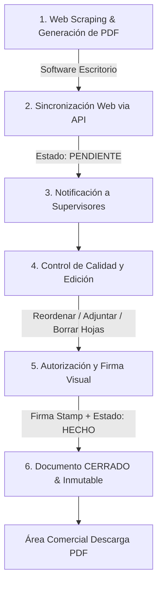

# Flujo de Trabajo del Proyecto: PDF Mining Web Hub

Este documento describe el flujo de operaciones (User Flow), los roles de usuario involucrados y el ciclo de vida de los reportes PDF desde su generación en las balanzas mineras hasta su aprobación final y almacenamiento inmutable en el portal.

---

## 1. Matriz de Roles y Responsabilidades

El sistema utiliza un control de acceso basado en roles (RBAC) para delegar las operaciones de gestión de PDFs.

| Rol | Descripción | Permisos Clave |
| :--- | :--- | :--- |
| **Administrador (ADMIN)** | Gestión total del portal y configuración global. | Gestión de usuarios, visualización de logs de auditoría completa, modificación de configuraciones generales. |
| **Supervisor de Región (EDITOR)** | Responsable del control de calidad y cierre de reportes de su zona. | Edición de PDFs (arrastrar, ordenar, eliminar, adjuntar), estampado de firma "Revisado", transición de estado a **HECHO**. |
| **Operador / Área Comercial (VIEWER)** | Creadores originales de registros y consumidores del PDF final. | Lectura de documentos de su región, adición de comentarios/comentarios de retroalimentación, descarga del PDF final. |

---

## 2. Flujo del Ciclo de Vida del Reporte PDF (End-to-End)

El proceso se compone de 6 etapas consecutivas que van desde la extracción física de datos en la mina hasta la inmutabilidad comercial del reporte:

### Etapa 1: Generación y Extracción (Desktop)
*   **Actor**: Software de Escritorio local.
*   **Acción**: El software de escritorio realiza web scraping de los datos de pesaje directamente desde los controladores de las balanzas físicas en la mina y genera un reporte preliminar en PDF.

### Etapa 2: Carga e Integración (API Webhook)
*   **Actor**: Servidor / Endpoint API (Futura Supabase Function).
*   **Acción**: El software de escritorio envía el PDF preliminar y sus metadatos (región, operador, fecha) al portal web mediante un webhook de subida.
*   **Estado**: El documento entra al sistema con estado **PENDIENTE**.

### Etapa 3: Notificación de Revisión
*   **Actor**: Sistema.
*   **Acción**: Los supervisores de la región correspondiente (ej: Lima, Antamina, Cusco) reciben una alerta de que hay un nuevo reporte de balanza listo para auditoría.

### Etapa 4: Edición y Control de Calidad
*   **Actor**: Supervisor de Región.
*   **Acción**: El supervisor accede al portal, revisa el listado y entra en la pantalla del **Editor**.
    *   **Miniaturas**: Revisa visualmente cada hoja.
    *   **Organización**: Si las páginas están desordenadas, las arrastra y suelta (Drag & Drop) en la posición correcta.
    *   **Corrección**: Si hay hojas duplicadas o erróneas, las selecciona y las elimina.
    *   **Complementos**: Si faltan hojas de pesajes anexos, adjunta archivos PDF adicionales desde su equipo local para concatenar páginas.

### Etapa 5: Firma y Aprobación
*   **Actor**: Supervisor de Región.
*   **Acción**: Una vez validado el contenido, el supervisor hace clic en **Estampar Firma de Revisado**. Esto coloca una marca visual en el documento (que certifica la validez comercial).
*   **Finalización**: Al presionar **Marcar como Finalizado**, el estado cambia a **HECHO** (o **CERRADO** según la fase comercial).

### Etapa 6: Distribución Comercial
*   **Actor**: Área Comercial / Operadores.
*   **Acción**: El PDF se bloquea para evitar ediciones futuras. Se habilita la opción de descarga directa del PDF optimizado final. Cualquier intento de edición posterior está restringido.

---

## 3. Trazabilidad de Auditoría (Audit Log Flow)

Para cumplir con normativas de seguridad industrial y auditorías de metales de Paltarumi, cada cambio en un documento debe registrarse cronológicamente:

1.  **Registro de Evento**: Cada vez que un usuario realiza una acción (`CREAR`, `MODIFICAR ORDEN`, `ELIMINAR PÁGINAS`, `ADJUNTAR ANEXO`, `FIRMAR`, `COMENTAR`), el frontend enviará una petición para insertar una traza en `audit_documents`.
2.  **Consulta de Historial**: Desde el Dashboard, los usuarios con permisos pueden pulsar **Historial (Trazabilidad)** en cualquier reporte para ver de inmediato la línea de tiempo de modificaciones.
3.  **Comentarios**: La sección de **Feedback** permite añadir notas explicativas en caso de que un reporte pase a estado `ERROR` (ej: *"Se detectó descuadre de 2 toneladas en ticket de página 2, re-subiendo"*).
