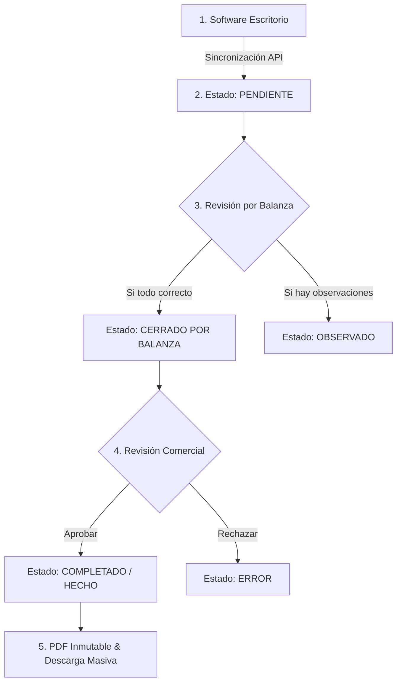

# Flujo de Trabajo del Proyecto: PDF Mining Web Hub

Este documento describe el flujo de operaciones (User Flow), los roles de usuario involucrados y el ciclo de vida de los reportes PDF desde su generación en las balanzas mineras hasta su aprobación final y almacenamiento inmutable en el portal.

---

## 1. Matriz de Roles y Responsabilidades

El sistema utiliza un control de acceso basado en roles (RBAC) para delegar las operaciones de gestión de PDFs:

| Rol DB | Área / Representante | Descripción y Permisos Clave |
| :--- | :--- | :--- |
| **`ADMIN`** | **Administrador** | Gestión total del portal, auditoría completa, usuarios y configuraciones generales. |
| **`EDITOR`** | **Área Comercial** | Acceso a Descarga Masiva (todos los estados y filtros). En el Editor: puede editar PDFs en borrador, estampar firma de revisado, marcar como **COMPLETADO** (pasa a `HECHO`), o declarar **ERROR**. Sobre documentos en `CERRADO POR BALANZA`, puede aprobarlos (**Marcar como Completado**) o rechazarlos (**Marcar como Error**). |
| **`VIEWER`** | **Balanza** | En el Editor: compila y cierra reportes (**Cerrar por Balanza** -> estado `CERRADO POR BALANZA`) o señala problemas (**Marcar como Observado** -> estado `OBSERVADO`). No puede marcar como `ERROR` ni `COMPLETADO` en estado cerrado. |

---

## 2. Flujo del Ciclo de Vida del Reporte PDF (End-to-End)

El proceso se compone de las siguientes etapas consecutivas:

```mermaid
graph TD
    A[1. Software Escritorio] -->|Sincronización API| B[2. Estado: PENDIENTE]
    B --> C{3. Revisión por Balanza}
    C -->|Si todo correcto| D[Estado: CERRADO POR BALANZA]
    C -->|Si hay observaciones| E[Estado: OBSERVADO]
    D --> F{4. Revisión Comercial}
    F -->|Aprobar| G[Estado: COMPLETADO / HECHO]
    F -->|Rechazar| H[Estado: ERROR]
    G --> I[5. PDF Inmutable & Descarga Masiva]
```

### Etapa 1: Generación y Extracción (Desktop)
*   **Actor**: Software de Escritorio local.
*   **Acción**: El software de escritorio realiza web scraping de los datos de pesaje directamente desde los controladores de las balanzas físicas en la mina y genera un reporte preliminar en PDF.

### Etapa 2: Carga e Integración (API Webhook)
*   **Actor**: Edge Function `sync-desktop-report`.
*   **Acción**: El software de escritorio envía el PDF preliminar y sus metadatos (región, empresa, operador) al portal web mediante `multipart/form-data` con autenticación Bearer JWT.
*   **Nomenclatura**: El nombre del archivo se preserva **tal cual** lo definió el operador en el escritorio (espacios incluidos, ej: `34 pato.pdf`). Se recomienda enviar el campo `filename` en el FormData además del archivo. El path interno en Storage es `{timestamp}-{nombre}`; el campo visible `documents.name` guarda el nombre original sin sanitizar.
*   **Estado**: El documento entra al sistema con estado **PENDIENTE** y se registra traza `CREATE` en `audit_documents`.

### Etapa 3: Notificación de Revisión
*   **Actor**: Sistema.
*   **Acción**: Los supervisores de la región correspondiente (ej: Lima, Antamina, Cusco) reciben una alerta de que hay un nuevo reporte de balanza listo para auditoría.

### Etapa 4: Edición y Control de Calidad
*   **Actor**: Supervisor de Región.
*   **Acción**: El supervisor accede al portal, revisa el listado y entra en la pantalla del **Editor**.
    *   **Miniaturas**: Revisa visualmente cada hoja.
    *   **Organización**: Si las páginas están desordenadas, las arrastra y suelta (Drag & Drop) en la posición correcta.
    *   **Corrección**: Si hay hojas duplicadas o erróneas, las selecciona y las elimina.
    *   **Complementos**: Si faltan hojas de pesajes anexos, adjunta archivos PDF adicionales desde su equipo local para concatenar páginas.

### Etapa 5: Firma y Aprobación
*   **Actor**: Supervisor de Región.
*   **Acción**: Una vez validado el contenido, el supervisor hace clic en **Estampar Firma de Revisado**. Esto coloca una marca visual en el documento (que certifica la validez comercial).
*   **Finalización**: Al presionar **Marcar como Finalizado**, el estado cambia a **HECHO** (o **CERRADO** según la fase comercial).

### Etapa 6: Distribución Comercial
*   **Actor**: Área Comercial / Operadores.
*   **Acción**: El PDF se bloquea para evitar ediciones futuras. Se habilita la opción de descarga directa del PDF optimizado final. Cualquier intento de edición posterior está restringido.

---

## 3. Trazabilidad de Auditoría (Audit Log Flow)

Para cumplir con normativas de seguridad industrial y auditorías de metales de Paltarumi, cada cambio en un documento debe registrarse cronológicamente:

1.  **Registro de Evento**: Cada vez que un usuario realiza una acción (`CREATE`, `UPDATE`, `CLOSE_BALANZA`, `CLOSE`, `OBSERVED`, `ERROR_MARKED`, `RENAME`, etc.), el sistema inserta una traza en `audit_documents`.
2.  **Consulta de Historial**: Desde el Dashboard, los usuarios pueden pulsar **Historial (Trazabilidad)** en cualquier reporte para ver la línea de tiempo de modificaciones.
3.  **Columna Última modificación por**: En los paneles PSAC y ECOGOLD, la tabla muestra el usuario que realizó la acción más reciente según `audit_documents` (no el operador original de la subida).
4.  **Comentarios**: La sección de **Feedback** permite añadir notas explicativas en caso de que un reporte pase a estado `ERROR` (ej: *"Se detectó descuadre de 2 toneladas en ticket de página 2, re-subiendo"*).
5.  **Renombrado**: Desde el dashboard se puede renombrar reportes en cualquier estado. En `CERRADO POR BALANZA` y `HECHO` solo se renombra el PDF firmado en `final-reports`; el crudo en `raw-reports` permanece intacto.
